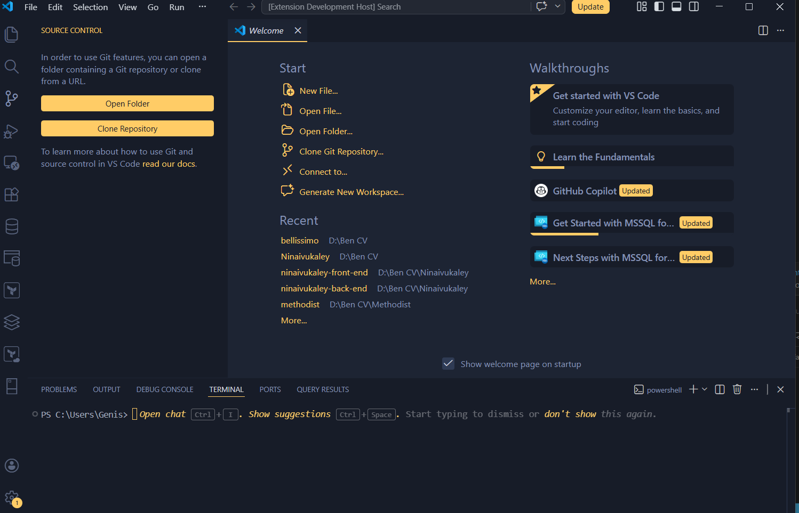

# Bellissimo VS Code Theme

**Bellissimo** is a sophisticated and elegant theme collection for Visual Studio Code. Designed with high readability and aesthetics in mind, it provides a comfortable coding environment for long sessions.

## 🌈 Variants

- **Bellissimo:** The classic dark slate theme with vibrant accents.
- **Bellissimo Midnight:** A deep, AMOLED-friendly version for those who love true blacks.
- **Bellissimo Light:** A crisp and clean light variant for daytime focus.

## ✨ Features

- **Semantic Highlighting:** Full support for VS Code's semantic tokens for more accurate code coloring.
- **High Readability:** Carefully balanced contrast ratios to reduce eye strain.
- **Vibrant Accents:** Distinctive colors for keywords, functions, and variables to make code structure clear.
- **Polished UI:** Consistent styling across all VS Code UI components, including the terminal, sidebar, and status bar.

## 🚀 Installation

1. Open **Extensions** sidebar panel in VS Code. `View → Extensions`
2. Search for `Bellissimo`
3. Click **Install** to install it.
4. Click **Reload** to reload the editor.
5. Code → Preferences → Color Theme → **Bellissimo** (or one of the variants).

## 🛠️ Supported Languages

Bellissimo is optimized for:
- JavaScript / TypeScript
- HTML / CSS / SCSS
- Python
- Go
- Rust
- C++ / C#
- Markdown
- JSON / YAML
- and many more!

## 📸 Screenshots

### JavaScript / TypeScript

## 📄 License

This theme is released under the [MIT License](LICENSE).

---

Developed with ❤️ by [Ben Hanan Subendran](https://github.com/hanancs)
